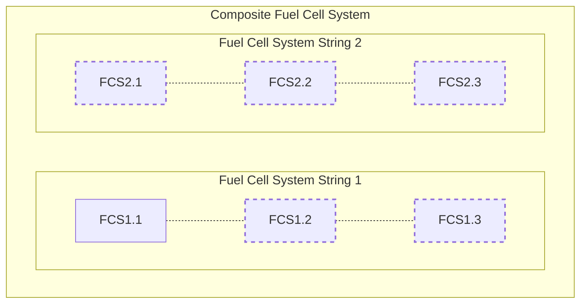
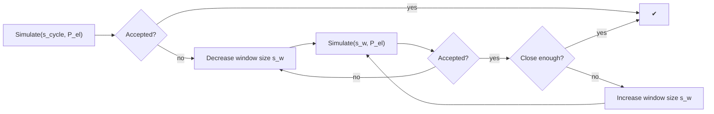
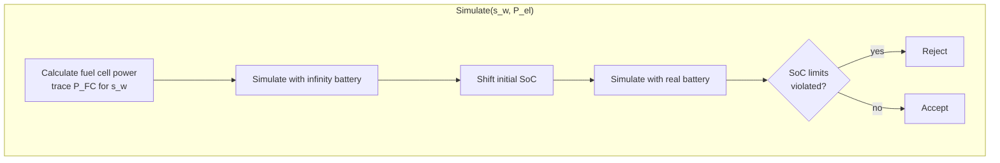

## Fuel Cell

The Composite Fuel Cell System (CFCS) can constist of up to two Fuel Cell System Strings (FCS String) with up to three Fuel Cell Systems (FCS) in each string.

### General approach
Fuel cell vehicles are simulated in a two-step approach. The first step is intended to obtain the optimal fuel cell power over the cycle. This is detemined in a pre-simulation run with extensive post-processing of these results. The second step is the simulation of the actual fuel cell vehicle with the fuel cell power trace obtained from the first simulation step.
The goal is to operate the CFCS as stationary as possible (i.e., avoid dynamic changes in the requested power) and to operate the individual FCS as close to their optimal operating point as possible.

#### Pre-simulation run
In the pre-simulation run the fuel cell vehicle is modeled and simulated as a PEV vehicle in charge depleting mode wit ha modified battery system (See [pre run battery](#pre-run-battery)). The power demand of the propulsion system is used to determine the fuel cell power demand over the distance in the driving cycle.

#### Determining the power of the fuel cell system
The fuel cell power at a given distance equals the average electric power demand over a certain distance window. The window size is mainly influenced by the battery size. VECTO aims to use the largest possible window size without violating the SoC limits at any given time or distance.

The start SoC is also adapted to the specific mission in order to maximize the usage of the battery as a buffer. For further details see [window algorithm](#window-algorithm)

#### Actual Simulation
During the actual simulation the power that is provided by the fuel cell system is already known. 
Deviations from the electric power demand are covered by the battery.

If the power demain for propulsion is higher than the power provided by the fuel cell, the battery is discharged, while if the fuel cell provides more power than the powertrail requires the battery is charged.

If the fuel cell system consists of more than one fuel cell the most efficient power distribution between the fuel cell strings is used (see [power distribution](#power-distribution))

#### Post Processing
In a post processing step $\Delta$ SoC is corrected to account for deviations from neutral SoC behaviour over the cycle.

##### Pre-run battery

The prerun battery constists of the battery that is provided with the vehicle and a second battery that reflects the power of the fuel cell.
The second battery has a discharging power equal to the maximum power of the fuel cell system and a charging power of 0 Watt.

To avoid violating the SoC-limits both of the batteries have infinite capacity.

##### Window algorithm
The power that should be provided by the fuel cell at a certain distance $s$ is calculated for a window size $s_w$ based on the trace of the electric power demand $P_{el}$ determined in the pre-run.
The maximum window size is equal to the length of the cycle ($s_{cycle}$)
At the beginning (and the end) of the cycle the window expands over the actual cycle, therefore $P_{el}$ is augmented with $P_{el}$ shifted to the left by $s_{cycle}$ (or to the right at the end of the cycle)

Given a window size $s_w$ and the power trace $P_{el}$. The fuel cell power at distance $s$ is the average $P_{el}$ inside the window.  

##### Window search algorithm
The window size is determined using the following algorithm, starting with the window size set to the cycle distance (which is the maximum possible window size).

**Close enough**: If the deviation of the last rejected window size and the last accepted window size is < 5% the search aborts and the largest accepted window size is used for further calculations.

**Increase/Decrease window size**
The window size is increased/decreased to $s_{w} = (s_{w, last \ accepted} + s_{w, last \ rejected})/2$ 

**Abort criterion** If the window size gets smaller than 5 m the simulation of the FCHV is aborted. 

**Calculate fuel cell power trace $P_{FC}$ for $s_{w}$**
For each distance s in the cycle, the average electric power demand (=$P_{fc,raw}$) in the window is calculated. 

The difference between the actual electric power demand $P_{el}[s]$ of the vehicle and the power that should be provided by the fuel cell $P_{fc, raw}[s]$ must be compensated by the battery, which leads to losses.

The losses of the battery as well as the maximum fuel cell power are considered when the final power of the fuel cell ($P_{fc}[s]$) is determined.

**Simulate with infinity battery**
Given the fuel cell power trace $P_{fc}[s]$ for each distance the remaining power is requested from the battery and VECTO keeps track of the current SoC.

Note: The SoC is always kept at CenterSoC. VECTO keeps track of a virtual SoC which is then used to calculate the new initial SoC.

**Shift initial SoC**
Using the virtual SoC range VECTO tries to set the initial SoC so that the SoC limits of the battery are not violated. If this is not possible (virtual SoC range is larger than the SoC range of the real battery) the window is too large and therefore rejected.

**Simulate with real battery**
Finally a request for each distance is send to the real battery starting with the updated initial SoC. If the SoC limits are violated the window size is rejected.

#### Power distribution
The trace of the fuel cell power reflects the power that has to be provided by the CFCS. If there are several FCS Strings, the power must be split between the individual FCS. Since the power of the CFCS is known before the actual simulation run for each distance in the cycle, the power distribution can also be calculated before the final simulation run.

Inside a FCS String the power is always equally distributed among the switched on fuel cell systems.

##### Power distribution among strings
For each distinct $P_{FC}$ occuring in the cycle the shares a (share of FCS String 1) and b (share of FCS String 2) are calculated.

$P_{FC} = a \cdot P_{FC} + b \cdot P_{FC} \Rightarrow a + b = 1 $

VECTO minimizes the fuel consumption $FC(P) = FC_{1}(a \cdot P) + FC_{2}(b \cdot P)$ at each operating point in the cycle.

##### Power distribution inside a string
Taking into account the power limits, VECTO calculates the number of active FCSs in an FCS string that lead to the lowest fuel consumption.

##### Time splitting
If the requested power on a string is lower than the power at the best efficiency point of a single FCS. In this case, a virtual "time splitting" is carried out, i.e. for the time step the FCS is operated at the best efficiency point for a fraction of the time corresponding to the requested power. For the rest of the time step, the FCS is considered switched off.

