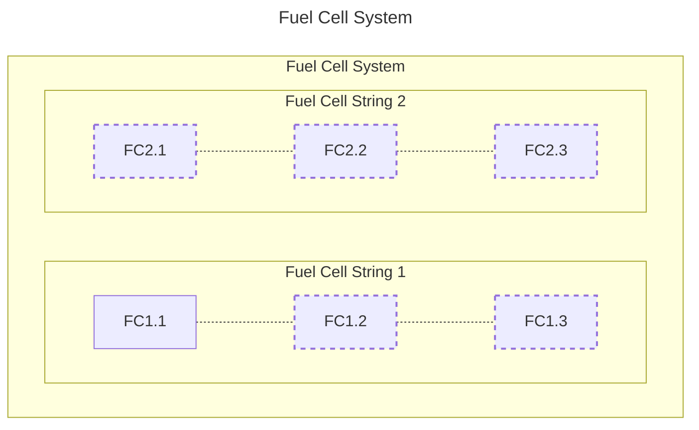
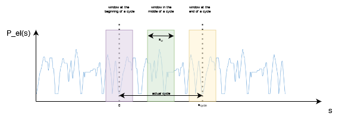
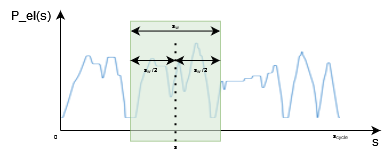
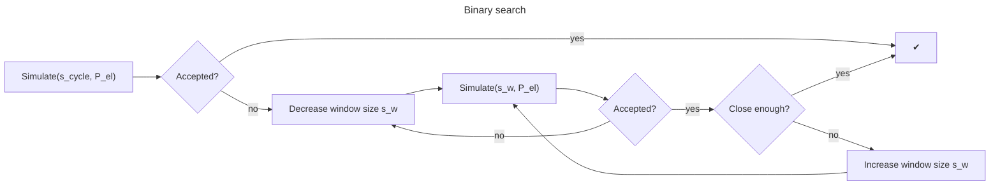
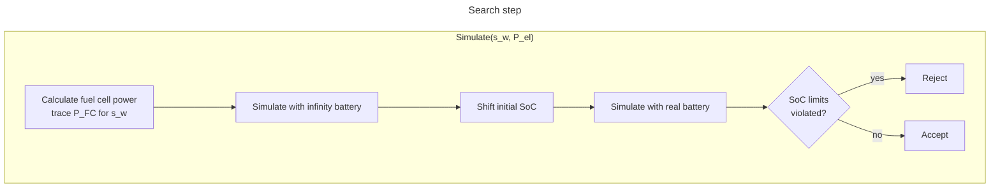

## Fuel Cell

The Fuel Cell System can constist of up to two fuel cell strings with up to three fuel cells in each string. (For more details see (!!!!link inputdata))

### General approach

#### Pre-simulation run
When simulating a fuel cell hybrid vehicle, the power provided by the fuel cell is determined based on the total electric energy demand of pre-run. In the pre-run the vehicle is simulated as PEV in charge depleting mode with a modified battery system (see [pre run battery](#pre-run-battery)). 

#### Determining the power of the fuel cell system
The fuel cell power for a given distance equals the average electric power demand over a certain distance window. The window size is mainly influenced by the battery size. Vecto aims to use the largest possible window size without violating the SoC limits at any given time or distance.

The start SoC is also adapted to the specific mission in order to maximize the usage of the battery as a buffer. For further details see [window algorithm](#window-algorithm)

#### Actual Simulation
During the actual simulation 
Based on the previous steps the power trace of the fuel cell is fixed and is sufficient to cover the actual energy demand of the vehicle. Deviations from the electric power demand are covered by the battery.

If the fuel cell system consists of more than one fuel cell the most efficient power distribution between the fuel cell strings is used (see [power distribution](#power-distribution))

#### Post Processing
In a post processing step $\Delta$ SoC is corrected to account for deviations from neutral SoC behaviour over the cycle.

##### Pre-run battery

The prerun battery constists of the battery that is provided with the vehicle and a second battery that reflects the power of the fuel cell.
The second battery has a discharging power equal to the maximum power of the fuel cell system and a charging power of 0 Watt.

To avoid violating the SoC-limits both of the batteries have infinite capacity.

##### Window algorithm
The power that should be provided by the fuel cell at a certain distance $s$ is calculated for a window size $s_w$ based on the trace of the electric power demand $P_{el}$ determined in the prerun.
The maximum window size is equal to the length of the cycle ($s_{cycle}$)
At the beginning (and the end) of the cycle the window expands over the actual cycle, therefore $P_{el}$ is augmented with $P_{el}$ shifted to the left by $s_{cycle}$ (or to the right at the end of the cycle)

Given a window size $s_w$ and the power trace $P_{el}$. The fuel cell power at distance $s$ is the average $P_{el}$ inside the window.  

##### Window binary search
The window size is determined using a binary search, starting with the window size set to the cycle distance (which is the maximum possible window size).
For each window size that is checked the following steps are performed:

**Close enough**: If the deviation of the last rejected window size and the last accepted window size is < 5% the search aborts and the largest accepted window size is used for further calculations.

**Increase/Decrease window size**
The window size is increased/decreased to $s_{w} = (s_{w, last \ accepted} + s_{w, last \ rejected})/2$ 

**Abort criterion** If the window size gets smaller than 5 m the simulation of the FCHV is aborted. 

**Calculate fuel cell power trace P_FC for s_w**
For each distance s in the cycle, the average electric power demand (=$P_{fc,raw}$) in the window is calculated. 

The difference between the actual electric power demand $P_{el}[s]$ of the vehicle and the power that should be provided by the fuel cell $P_{fc, raw}[s]$ must be compensated by the battery, which leads to losses.

The losses of the battery as well as the maximum fuel cell power are considered when the final power of the fuel cell ($P_{fc}[s]$) is determined.

**Simulate with infinity battery**
Given the fuel cell power trace $P_{fc}[s]$ for each distance the remaining power is requested from the battery and VECTO keeps track of the current SoC.

*Note: The SoC is always kept at CenterSoC. VECTO keeps track of a virtual SoC that is used for shifting

**Shift initial SoC**
Using the virtual SoC range VECTO tries to set the Initial SoC so that the SoC limits of the battery are not violated. If this is not possible (virtual SoC range is larger than the SoC range of the battery) the window is too large and therefore rejected.

**Simulate with real battery**
Finally a request for each distance is send to the real battery starting with the updated initial SoC. If the SoC limits are violated the window size is rejected.

##### Power distribution

The trace of the fuel cell power reflects the power that has to be provided by the complete fuel cell system. If there are several fuel cell strings, the power must be split between the individual fuel cells. Since the power of the fuel cell system is known before the actual simulation run for each distance in the cycle, the power distribution can also be calculated before the final simulation run.

##### Power distribution among the strings
For each distinct $P_{FC}$ occuring in the cycle the shares a (power that has to be provided by string 1) and b (power that has to be provided by string 2) are calculated.

$P_{FC} = a \cdot P_{FC} + b \cdot P_{FC} \Rightarrow a + b = 1 $

VECTO minimizes the fuel consumption $FC(P) = FC_{1}(a \cdot P) + FC_{2}(b \cdot P)$ at each operating point

