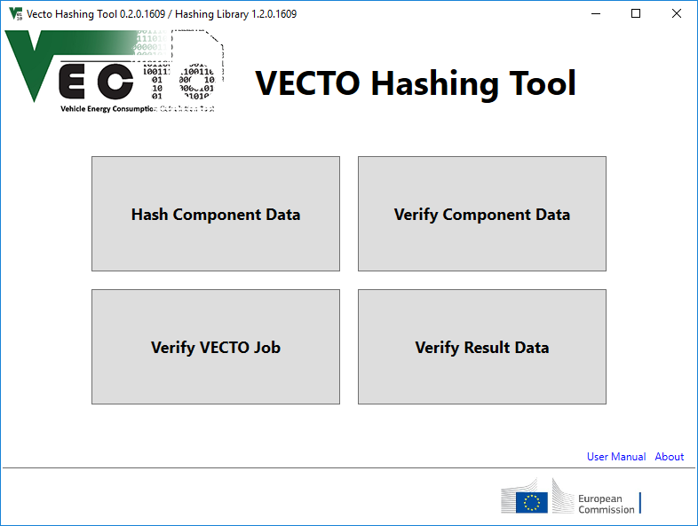
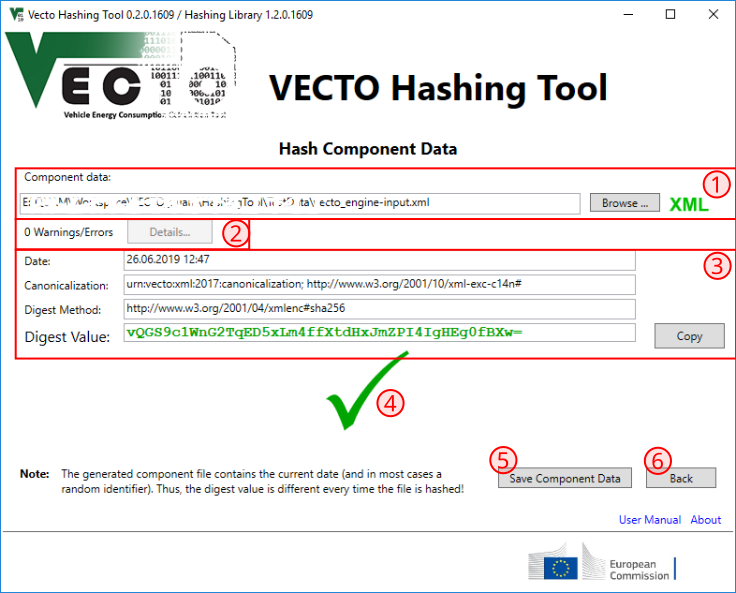
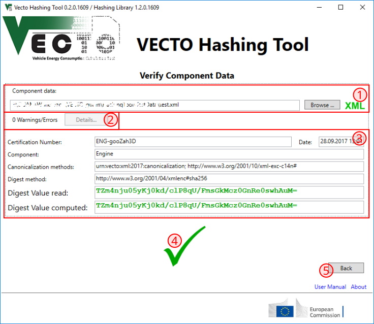
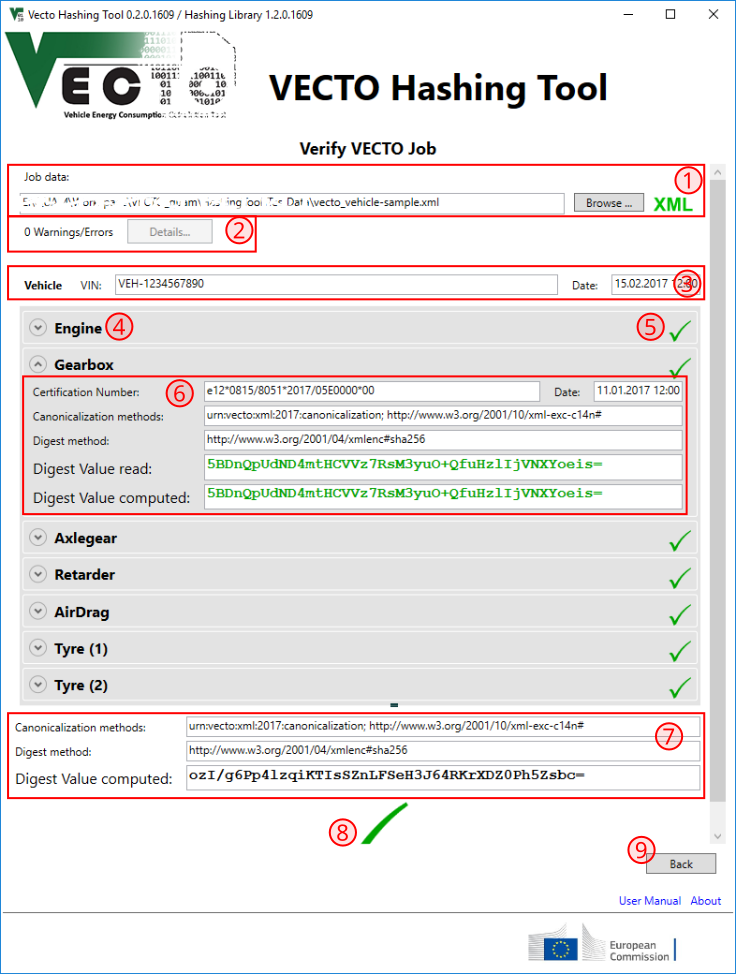

# VECTO Hashing Tool

Version: 1.2

The VECTO Hashing tool provides functionality for hashing coponent data, checking the integrity of component data, checking the integrity of VECTO job data, and checking the integrity of VECTO reports and its job files.

## General 

VECTO input data and VECTO results for certification of heavy duty vehicles uses the XML format. The XML schema for
botht, input data and results, can be found under the following URL and are distributed with the VECTO simulation tool.

- https://webgate.ec.europa.eu/CITnet/svn/VECTO/trunk/Share/XML/XSD/

## Method of Hash Computation

### Introduction

The integrity of electronic data, i.e., component data, job data, and VECTO results is of major importance throughout the whole process of vehicle CO2 certification and in particular among data exchange between the involved participants. The Commission and industry partners agreed to use (witnessed) cryptographic hashes as 
integrity measure for all kinds of data. The digest value (cryptographic hash) shall be stored at a second 
site, i.e., the type approval authority in case of component data, and the CO2 monitoring instance and the customer in case of the VECTO simulation results. Comparing the digest value of a component in the job data or the simulation result data with the digest value stored at the type approval authority allows to confirm the integrity of the component data, for example.

VECTO component data, VECTO job data, and VECTO simulation results are handled in XML format. Consequently, the agreed method for computing the digest value of electronic data is based on the [XML Dsig|https://www.w3.org/TR/xmldsig-core/] standard, which is also used for [eIDAS|http://data.europa.eu/eli/reg/2014/910/oj] and [XML Advanced Electronic Signatures(XAdES)|https://www.w3.org/TR/XAdES/].

For VECTO related data the detached signature approach is used, where the component data and the signature element are in the same XML document.

The XML representation of a certain XML document is ambiguous. Whitespaces, line breaks, comments, etc. may be added in various positions without actually altering the XML document's data. This is a huge drawback when directly applying cryptographic methods on XML documents, because changing for example the indentation (tab vs. spaces) invalidates all cryptographic operations although the content (and semantic) of the XML data is still the same. Therefore, it is crucial to use the same physical representation (called canonical form) of an XML document before applying cryptographic operations.
Consequently, if two documents have the same canonical form, then the two documents are logically equivalent 
within the given application context. The [Canonical XML|https://www.w3.org/TR/xml-c14n11/] standard defines general transformations applied to an XML document to derive its canonical form. However, even after applying the canonicalization as described in the canonicalization standard, two XML documents with different canonical forms may still be equivalent in the context of VECTO for the following reasons:

  - Entries in loss-maps, engine full-load curve, engine fuel-consumption map, etc. may be listed in 
    arbitrary order
  - Gear entries in the transmission component may be listed in arbitrary order
  - The vehicle's axles may be listed in arbitrary order
  - Numeric values may be provided in different accuracy without affecting the simulation results.

For the last issue, the XML schema has been designed to require a defined number of digits after the decimal sign and no leading zeros are allowed. 

To cope with the first three issues, an additional canonicalization transformation of the XML document is necessary. This canonicalization transformation sorts all ambiguous entries in a defined manner and is described programming language independent as XSLT transformaton. This XSLT transformation can be found under the following address and is shipped together with the VECTO hashing tool.

https://webgate.ec.europa.eu/CITnet/svn/VECTO/trunk/Share/XML/HashingXSLT/

### Hash Computation

Computing the digest value of an XML document in the VECTO context is done applying the following steps:

  1. Apply the VECTO-specific canonicalization (i.e., sorting of ambiguous entries). This transformation is 
     identified via the URI "urn:vecto:xml:2017:canonicalization" 
  2. Apply the generic XML canonicalization (http://www.w3.org/2001/10/xml-exc-c14n#)
  3. Compute the digest value using one of the supported digest methods

Currently, only two canonicalization methods, namely http://www.w3.org/2001/10/xml-exc-c14n#, and urn:vecto:xml:2017:canonicalization, and one digest method, namely http://www.w3.org/2001/04/xmlenc#sha256 are supported. Both canonicalization methods are mandatory (as described above). Further methods may be added later.

## Main Screen

The main screen allows to select from the four main functionalities the VECTO Hashing Tool provides.

## Hashing Component Data

### Functionality

The "Hash Component Data" window allows to compute the digest value and adds the Signature element to an XML component file.

The selected component data file has to be in the form of an XML component file as described in the XML schema, *except* it *must not* contain the Signature element following the Data element. Moreover, the selected file has to be a component file (engine, gearbox, axlegear, angledrive, tyre, retarder, torque converter), other file types such as job files and report files are *not supported*!.

The component data may already contain an id-attribute in the Data element. However, if the length of the id value is less than 5 characters it will be overwritten by the hashing tool in order to guarantee sufficient uniqueness.

The Date element in the component data will be overwritten in any case with the current time.

As a refeence for the user, the GUI shows the canonicalization method and digest method used as well as the computed digest value. The digest value can be easily copied to be used in other applications or filled into the certification report.

If the generated component file validates against the XML schema it can be saved to disk. Otherwise, the error messges and warnings can be inspected via the /Details.../ button.

### UI Elements

1 ... File selection dialog, see [here fore more details](#file-selection-dialog)
2 ... Error indicator. Shows more details in case the selected file could not be read correctly (see [error dialgo](#error-dialog)).
3 ... Information area. If the generated component file is valid this area shows the canonicalization methods and digest method used to compute the digest value shown below. The digest value can be copied to tye clipboard using the 'Copy' button next to the textbox showing the digest value.
4 ... Status indicator. Either shows a green checkmark in case the generated component file is valid or a red cross if the component file is not valid. More details can be found in the [error dialgo](#error-dialog).
5 ... Allows to save the component file if it is valid.
6 ... Go back to the main screen

## Verifying Integrity of Component Data

### Functionality

The 'Verify Component Data' screen allows to verify the integrity of a component file. The canonicalization methods and digest method as well as the digest value are read from the selected XML file and displayed. Using the same canonicalization methods and digest method the digest value is re-computed. If the computed digest value equals the digest value read from the file the component file is valid.

In case the computed digest value does not equal the digest value read from the file the component file is invalid and may not be used further.

### UI Elements

1 ... File selection dialog, see [here fore more details](#file-selection-dialog)
2 ... Error indicator. Shows more details in case the selected file could not be read correctly (see [error dialgo](#error-dialog)).
3 ... Information area. Displays the VECTO component identified in the file, its certification date, the canonicalization methods and digest method as well as the digest value contained in the selected file. The VECTO Hashing Tool re-computes the digest value using the same methods as specified in the file and shows it in the informaiton area. 
4 ... Status indicator. If the digest values match (i.e., the component file is valid)  a green checkmark is shown or a red cross if the component file is not valid. More details can be found in the [error dialgo](#error-dialog).
5 ... Go back to the main screen

## Verifying Integrity of VECTO Job Data

### Functionality

The 'Verify VECTO Job' screen allows to verify the integrity of all components in a VECTO Job file. This means that for every component in the job-data the canonicalization methods and digest methods are read and the digest value for the component is computed in the same way. If the component's digest value of the job-data matches the re-computed digest value, the component is considered valid. If all components in the job-data are valid, the whole job-data is valid.

The vehicle identification number and the creation date of the job-data are shown in the user-interface.
For every component the certification number and certification date as well as the canonicalization methods, digest method and both, the digest value from the job data and the re-conputed digest value are listed. 
Additionally, the digest value of the job data using the current default canonicalization methods and digest method is displayed for information purposes.

### UI Elements

1 ... File selection dialog, see [here fore more details](#file-selection-dialog)
2 ... Error indicator. Shows more details in case the selected file could not be read correctly (see [error dialgo](#error-dialog)).
3 ... Vehicle identification number and creation date of the selected job-file
4 ... List of component identified in the file
5 ... Indicator if the integrity of the component is valid
6 ... Detailed information for every component, showing the component's certification number, certification date, canonicalization methods and digest method as well as the digest value from the job-file and the re-computed digest-value.
7 ... Information area showing the job's digest value using the current default canonicalization methods and digest method.
8 ... Status indicator. If the digest values match (i.e., the component file is valid)  a green checkmark is shown or a red cross if the component file is not valid. More details can be found in the [error dialgo](#error-dialog).
9 ... Go back to the main screen

## Verifying Integrity of VECTO Results

### Functionality

The 'Verify Result Data' screen alloss to verify the integrity of the job data and both reports generated by VECTO, the manufacturer's record report and the customer report. Validation is done as described in the following.

#### Integrity of Job Data

The job-data is considered valid if the integrity of all containing components is valid, i.e. the digest value in the job-data matches the re-computed digest value. For details see [Verifying Integrity VECTO Job Data](#verifying-integrity-of-vecto-job-data).

#### Integrity of Manufacturer Report

The manufacturer report is considered valid if the given digest value matches the re-computed digest value, using the specified canonicalization methods and digest methods.

#### Integrity of Customer Report

The customer report is considered valid if the given digest value matches the re-computed digest value, using the specified canonicalization methods and digest methods.

#### Validation of Manufacturer Report

If both, the job-data and the manufacturer report are valid, more extensive checks 

### UI Elements

## Using the Hashing Library

## General UI Elements

### File Selection Dialog

ToDo: Image

The file selection dialog allows to browse for a file in the VECTO Hashing Tool via the 'Browse...' button. Alternatively, the path to an XML file can be entered into the textfield. Next to the 'Browse...' button is a status indicator showing the status of the selected file. 

 No file has been selected

 Failed to read the file. Check that the file exists and is an XML file.

 Failed to validate the selected XML file against a known XML schema. Check that the selected file is a valid VECTO XML file

 The selected file is a valid VECTO XML file but has the wrong contents. Check that the selected file contains the expected data (e.g., component data, job data, report, etc.)

  The selected file is a valid VECTO XML file and has the correct contents.

### Error Dialog

ToDo: Image

This dialog shows more details about errors during loading a VECTO XML file and validating its contents. The error messages can be copied to the clipboard using the 'Copy Errors' button.